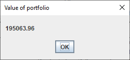

### Stock Trading Tutor
___
Hello!

This application is a multi-portfolio & multi-strategy management application. It uses AlphaVantage API to fetch the stock data. It has an LRU cache to reduce the number of API calls (since the free tier only allows 5 calls). JFreeChart is used to dynamically plot the performance portfolio (cost-basis and value) using JFreeChart.

PS: I'm working on arranging the project in a better way, but here are a few screenshots to give you a feel of the application.

  
##### Performance of the Portfolio
To plot the performance of the portfolio - 
1. Click on `Graph` on the left hand side panel
2. Choose the source of the portfolio (I have chosen to plot a saved portfolio)
3. Select the `From file` radio button
4. Enter the `start date` and `end date`
5. Click on `Submit`

#### Portfolio Information
To view information like Value and Cost Basis of a portfolio - 
1. Click on the `Value / Cost Basis` button on the left hand side panel.
2. If the portfolio is saved (persisted) in a file
    - Click on `Load from file`
    - Navigate to the location of the persisted portfolio
3. If the portfolio is not yet saved as a file
    - Enter the portfolio name in the text box 
4. Enter the date (We have entered 2018-12-12)
5. Click on the radio button if the portfolio is a saved file
6. Click on the suitable portfolio information (`Calculate cost basis` or `Calculate Value`) 

##### Cost-basis of a portfolio
Once you click on 'Calculate cost basis, the following window pops up'

##### Value of a portfolio
Once you click on 'Calculate Value, the following window pops up'

